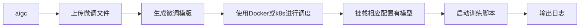

# AIGC 管理平台

AIGC平台是一个综合了模型管理、模型部署、模型微调、渠道管理等功能的平台，通过该平台可以快速的部署模型、微调模型、管理模型、管理渠道等功能。

## 项目简介

前端UI是一个独立的项目，点击[aigc-admin-web](https://github.com/IceBear-CreditEase-LLM/aigc-admin-web)查看

### 系统架构设计

系统是前后端分离的架构。

#### 模型推理框架

我们使用的是[FastChat](https://github.com/lm-sys/FastChat)作为模型推理框架，FastChat是一个非常优秀的开源项目。

> [FastChat](https://github.com/lm-sys/FastChat) 是一个开放平台，用于训练、服务和评估基于大型语言模型的聊天机器人。

**FastChat我们主要用其三个服务**

`controller` 用于模型的注册中心及健康检查

`worker` 服务启动模型并将当前模型注册到controller

`api` 从controller获取模型的地址代理到worker并提供标准API

我们主要通过它来实现大模型的高可用，高可扩展性。


模型部署的操作可以参考[模型部署](docs/model/list.md)

### 模型微调

为了实现模型的微调，您可以参考我们的详细指南：[模型微调](docs/model/finetune.md)。

### 模型部署与微调

您可以将模型部署到任意配备GPU的节点上，无论是私有的K8s集群、Docker集群，还是云服务商提供的K8s集群，均能轻松对接。

### 本系统组成

本系统主要由以下几个部分组成：

- **HTTP服务**：提供Web服务接口，方便用户进行交互。
- **定时任务**：执行预定任务，如模型训练、数据预处理等。
- **训练镜像**：包含所有必要的环境和依赖，用于模型的训练和微调。

- 通过这些组件的协同工作，我们能够提供一个灵活、高效的模型微调和部署解决方案。

#### 部署流程


#### 微调训练流程



## 使用手册

[AIGC平台使用手册](docs/SUMMARY.md)

### 安装使用步骤

**将子项目一起克**

- 克隆项目: `git clone --recursive https://github.com/IceBear-CreditEase-LLM/aigc-admin.git`
- 进入项目: `cd aigc-admin`
- 更新子项目: `git submodule update`

该系统依赖**Mysql**、**Redis**和**Docker**需要安装此服务

推理或训练节点只需要安装**Docker**和**Nvidia-Docker**
即可。[NVIDIA Container Toolkit](https://github.com/NVIDIA/nvidia-container-toolkit)

#### 本地开发

[golang](https://github.com/golang/go)版本请安装go1.21以上版本

- 安装依赖包: `go mod tidy`
- 本地启动: `make run`
- build成x86 Linux可执行文件: `make build-linux`
- build成当前电脑可执行文件: `make build`

build完通常会保存在 `$(GOPATH)/bin/` 目录下

#### Docker部署

安装docker和docker-compose可以参考官网教程：[Install Docker Engine](https://docs.docker.com/engine/install/)

执行命令启动全部服务

```
$ docker-compose up
```

如果不需要执行build流程，可以进入到`docker`目录下执行`docker-compose up`即可。或把`docker-compose.yaml`的`build`注释掉。

### 项目配置

项目配置可以通过命令行传参或环境变量两种方式进行配置

#### 通过命令行传参

**需要注意的是，如果即设置了环境变量也设置了命令行参数，那么命令行参数的值会覆盖环境变量的值**

执行: `./aigc-admin --help` 查看命令行参数

```bash
Usage:
  aigc-admin [command]

Available Commands:
  completion  Generate the autocompletion script for the specified shell
  cronjob     定时任务
  generate    生成命令
  help        Help about any command
  job         任务命令
  start       启动http服务

Flags:
  -c, --config.path string              配置文件路径，如果没有传入配置文件路径则默认使用环境变量
      --db.drive string                 数据库驱动 (default "mysql")
      --db.mysql.database string        mysql数据库 (default "aigc")
      --db.mysql.host string            mysql数据库地址: mysql (default "mysql")
      --db.mysql.metrics                是否启GORM的Metrics
      --db.mysql.password string        mysql数据库密码
      --db.mysql.port int               mysql数据库端口 (default 3306)
      --db.mysql.user string            mysql数据库用户 (default "aigc")
      --docker.datacfspath string       data CFS Path (default "/tmp")
      --docker.workspace string         任务配置文件的存放目录 (default "/tmp")
  -h, --help                            help for aigc-admin
      --ldap.base.dn string             LDAP Base DN (default "OU=HABROOT,DC=ORG,DC=corp")
      --ldap.bind.pass string           LDAP Bind Password
      --ldap.bind.user string           LDAP Bind User (default "aigc_ldap")
      --ldap.group.filter string        LDAP Group Filter
      --ldap.host string                LDAP地址 (default "ldap://ldap")
      --ldap.port int                   LDAP端口 (default 389)
      --ldap.use.ssl                    LDAP Base DN
      --ldap.user.attr strings          LDAP Attributes (default [name,mail,userPrincipalName,displayName,sAMAccountName])
      --ldap.user.filter string         LDAP User Filter (default "(userPrincipalName=%s)")
  -n, --namespace string                命名空间 (default "aigc")
      --redis.auth string               连接Redis密码
      --redis.db int                    连接Redis DB
      --redis.hosts string              连接Redis地址 (default "redis:6379")
      --redis.prefix string             Redis写入Cache的前缀 (default "aigc")
      --server.admin.pass string        系统管理员密码 (default "admin")
      --server.admin.user string        系统管理员账号 (default "admin")
      --server.debug                    是否开启Debug模式
      --server.key string               本系统服务密钥 (default "Aigcfj@202401")
      --server.log.drive string         本系统日志驱动, 支持syslog,term (default "term")
      --server.log.level string         本系统日志级别 (default "all")
      --server.log.name string          本系统日志名称 (default "aigc-admin.log")
      --server.log.path string          本系统日志路径
  -a, --server.name string              本系统服务名称 (default "aigc-admin")
      --server.storage.path string      文件存储绝对路径 (default "/usr/local/bin/aigc-admin/storage")
      --service.alarm.token string      告警中心服务地址 (default "http://alarm:8080")
      --service.local.ai.host string    Chat-Api 地址 (default "http://fschat-api:8000/v1")
      --service.local.ai.token string   Chat-Api Token (default "sk-001")
      --service.openai.enable           是否启用OpenAI服务
      --service.openai.host string      OpenAI服务地址 (default "https://api.openai.com/v1")
      --service.openai.model string     OpenAI模型名称 (default "gpt-3.5-turbo")
      --service.openai.org.id string    OpenAI OrgId
```

##### 启动http服务

执行: `./aigc-admin start` 启动服务

```
Usage:
  aigc-admin start [flags]

Flags:
      --cors.allow.credentials       是否允许跨域访问的凭证 (default true)
      --cors.allow.headers string    允许跨域访问的头部 (default "Accept,Content-Type,Content-Length,Accept-Encoding,X-CSRF-Token,Authorization")
      --cors.allow.methods string    允许跨域访问的方法 (default "GET,POST,PUT,DELETE,OPTIONS")
      --cors.allow.origins string    允许跨域访问的域名 (default "*")
      --cors.enable                  是否开启跨域访问
      --cors.expose.headers string   允许跨域访问的头部 (default "Content-Length,Access-Control-Allow-Origin,Access-Control-Allow-Headers,Content-Type")
  -h, --help                         help for start
  -p, --http.port string             服务启动的http端口 (default ":8080")
      --server.domain string         启动服务的域名 (default "http://localhost:8080")
      --tracer.drive string          Tracer驱动 (default "jaeger")
      --tracer.enable                是否启用Tracer
      --tracer.jaeger.host string    Tracer Jaeger Host (default "jaeger:6832")
      --tracer.jaeger.log.spans      Tracer Jaeger Log Spans
      --tracer.jaeger.param float    Tracer Jaeger Param (default 1)
      --tracer.jaeger.type string    采样器的类型 const: 固定采样, probabilistic: 随机取样, ratelimiting: 速度限制取样, remote: 基于Jaeger代理的取样 (default "const")
      --web.embed                    是否使用embed.FS (default true)
```

##### 启动定时任务

执行: `./aigc-admin cronjob start` 启动定时任务

```
Usage:
  aigc-admin cronjob start <args> [flags]

Examples:
如果 cronjob.auto 设置为 true 并且没有传入相应用的任务名称，则将自动运行所有的任务

aigc-admin cronjob start -h

Flags:
      --cronjob.auto   是否自动执行定时任务 (default true)
  -h, --help           help for start
```

#### 系统公共环境变量配置

可以修改`.env`调整相关配置

| 类别                | 变量名                                   | 描述                     | 值                                                                                                 |
|-------------------|---------------------------------------|------------------------|---------------------------------------------------------------------------------------------------|
| 数据库配置             | AIGC_DB_DRIVER                        | 数据库驱动类型（可能的遗留错误）       | mysql                                                                                             |
|                   | AIGC_MYSQL_DRIVE                      | 数据库驱动类型                | mysql                                                                                             |
|                   | AIGC_MYSQL_HOST                       | 数据库主机地址                | mysql                                                                                             |
|                   | AIGC_MYSQL_PORT                       | 数据库端口号                 | 3306                                                                                              |
|                   | AIGC_MYSQL_USER                       | 数据库用户名                 | aigc                                                                                              |
|                   | AIGC_MYSQL_PASSWORD                   | 数据库密码                  | admin                                                                                             |
|                   | AIGC_MYSQL_DATABASE                   | 数据库名                   | aigc                                                                                              |
| Redis 配置          | AIGC_REDIS_HOSTS                      | Redis服务地址和端口           | redis:6379                                                                                        |
|                   | AIGC_REDIS_PREFIX                     | Redis前缀                | aigc                                                                                              |
|                   | AIGC_REDIS_PASSWORD                   | Redis访问密码              |                                                                                                   |
| Tracer 链路追踪配置     | AIGC_TRACER_ENABLE                    | 是否启用链路追踪               | false                                                                                             |
|                   | AIGC_TRACER_DRIVE                     | 链路追踪驱动类型               | jaeger                                                                                            |
|                   | AIGC_TRACER_JAEGER_HOST               | Jaeger服务地址             |                                                                                                   |
|                   | AIGC_TRACER_JAEGER_PARAM              | Jaeger采样参数             | 1                                                                                                 |
|                   | AIGC_TRACER_JAEGER_TYPE               | Jaeger采样类型             | const                                                                                             |
|                   | AIGC_TRACER_JAEGER_LOG_SPANS          | 是否记录追踪日志               | false                                                                                             |
| 跨域配置              | AIGC_ENABLE_CORS                      | 是否启用CORS               | true                                                                                              |
|                   | AIGC_CORS_ALLOW_METHODS               | 允许的方法                  | GET,POST,PUT,DELETE,OPTIONS                                                                       |
|                   | AIGC_CORS_ALLOW_HEADERS               | 允许的头                   | Accept,Content-Type,Content-Length,Accept-Encoding,X-CSRF-Token,Authorization,x-tenant-id,x-token |
|                   | AIGC_CORS_ALLOW_CREDENTIALS           | 是否允许凭证                 | true                                                                                              |
|                   | AIGC_CORS_ALLOW_ORIGINS               | 允许的来源                  | *                                                                                                 |
| 外部服务调用配置          | AIGC_SERVICE_ALARM_HOST               | 报警服务地址                 |                                                                                                   |
|                   | AIGC_SERVICE_CHAT_API_HOST            | 聊天API服务地址              | http://fschat-api:8000                                                                            |
|                   | AIGC_SERVICE_OPENAI_HOST              | OpenAI配置服务地址           | https://api.openai.com/v1                                                                         |
| LDAP 配置           | AIGC_LDAP_HOST                        | LDAP服务器地址              | ldap                                                                                              |
|                   | AIGC_LDAP_BASE_DN                     | LDAP基础DN               | OU=HABROOT,DC=corp                                                                                |
|                   | AIGC_LDAP_USER_ATTR                   | LDAP用户属性               | name,mail,userPrincipalName,displayName,sAMAccountName                                            |
| aigc-admin 环境变量配置 | AIGC_ADMIN_SERVER_HTTP_PORT           | 服务HTTP端口               | :8080                                                                                             |
|                   | AIGC_ADMIN_SERVER_LOG_DRIVE           | 日志驱动类型                 | term                                                                                              |
|                   | AIGC_ADMIN_SERVER_NAME                | 服务名称                   | aigc-admin                                                                                        |
|                   | AIGC_ADMIN_SERVER_DEBUG               | 是否开启调试模式               | true                                                                                              |
|                   | AIGC_ADMIN_SERVER_LOG_LEVEL           | 日志级别                   | all                                                                                               |
|                   | AIGC_ADMIN_SERVER_LOG_NAME            | 日志文件名称                 | aigc-admin.log                                                                                    |
|                   | AIGC_ADMIN_SERVER_DEFAULT_CHANNEL_KEY | 默认渠道密钥                 | sk-001                                                                                            |
|                   | AIGC_ADMIN_SERVER_ADMIN_USER          | 初始化默认账号                | admin                                                                                             |
|                   | AIGC_ADMIN_SERVER_ADMIN_PASS          | 初始化默认密码                | admin                                                                                             |
| Docker 配置         | AIGC_DOCKER_CHAT_DATA_CFS_PATH        | 本机的模型数据路径映射到容器的/data目录 | /tmp/data                                                                                         |
|                   | AIGC_DOCKER_WORKSPACE                 | Docker的工作目录            | /tmp/docker-home                                                                                  |

## Docker镜像

我们提供了Docker镜像，您可以直接使用我们提供的镜像，也可以自行构建。

- [LLMOps](docker/llmops-deepspeed/README.md)
- [百川2](docker/baichuan2/README.md)
- [FastChat](docker/fastchat/README.md)
- [Qwen](docker/qwen/README.md)
- [Vicuna](docker/vicuna/README.md)

### 文件资源目录

```
.
├── CHANGELOG                   # 变更日志
├── Dockerfile                  # Dockerfile 构建
├── Makefile                    # Makefile 构建
├── README.md                   # 项目说明
├── aigc-admin.service          # systemd 服务配置
├── cmd                         # 项目入口
│ ├── data                      # 数据目录
│ ├── main.go
│ ├── service                   # 服务启动从这里开始
│ └── web
├── docker                      # docker 镜像构建
├── docs                        # 文档
├── go.mod                      # go mod 依赖
├── go.sum
├── src                         # 项目源码
│ ├── api                       # 调用外部API模块
│ ├── encode                    # 输出编码模块
│ ├── logging                   # 日志处理模块
│ ├── middleware                # 中间件模块
│ ├── pkg                       # 项目模块目录
│ │ ├── assistants              # 助手模块
│ │ ├── auth                    # 认证模块
│ │ ├── channels                # 渠道模块
│ │ ├── datasets                # 数据集模块
│ │ ├── files                   # 文件模块
│ │ ├── finetuning              # 微调模块
│ │ ├── models                  # 模型模块
│ │ ├── sys                     # 系统模块
│ │ └── tools                   # 工具模块
│ ├── repository                # 数据库操作模块
│ └── util                      # 工具模块
└── tests                       # 测试模块
```